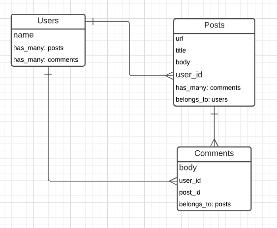
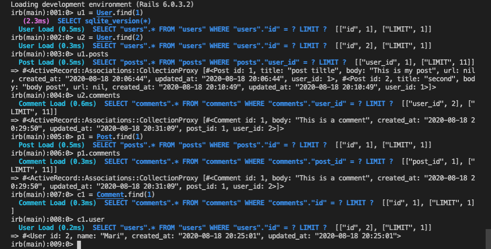

# Building with Active Record

> This project goal is to practice the knowledge about active record, models, and associations. We built n application similar to Reddit (called Micro-Reddit) where a user can create a post and add comments to it.

This project consists of three models (User, Post, and Comment), that are related to each other as the layout below.

## Features

- Create and get User
- Create and get Posts (it should contain a body and the id of the user author)
- Create and get Comments ( that should contain a body, an author and the post that it belongs to)

## Built With

- ruby '2.7.1'
- 'rails', '~> 6.0.3', '>= 6.0.3.2'
- 'sqlite3', '~> 1.4'

## Getting Started

​To have a version on your local machine:

- Clone this repository
- Open a terminal on the containing folder of this project
- Run 'bundle install' to install the dependences
- Set the database using the command 'bin/rake db:migrate'
- You can use the general commands to create objects or get them.

- To create a User

> User.create(name: "John")

- To create a Post

> Post.create(title: "My first post", body: "Post content example", user_id: 1)

- To create a comment

> Comment.create(body: "Comment example", user_id: 1, post_id: 1)

- Use the #find method to get a user, post or a comment by its id:

> User.find(2)

- Get all the posts from a user using #posts or all the comments using #comments

> user1 = User.find(1)

> user1.posts

> user1.comments

- It's also possible to return the first or the last register of a model using #first or #last

> user1.first

> user2.last

## Authors

👤 **Marilena Roque**

- Github: [MarilenaRoque](https://github.com/MarilenaRoque)
- Twitter: [@MariRoq88285995](https://twitter.com/MariRoq88285995)
- Linkedin: [roquemarilena](https://www.linkedin.com/in/roquemarilena/)

👤 **Emanuel González**

- Github: [@emasdev](https://github.com/emasdev)
- Twitter: [@elemasss](https://twitter.com/elemass)
- Linkedin: [@emasdev](https://www.linkedin.com/in/emasdev/) 

## 🤝 Contributing

Contributions, issues and feature requests are welcome!

Feel free to check the [issues page](issues/).

## Show your support

Give a ⭐️ if you like this project!

## Acknowledgments

- Hat tip to anyone whose code was used
- Inspiration
- etc

## 📝 License

This project is [MIT](lic.url) licensed.